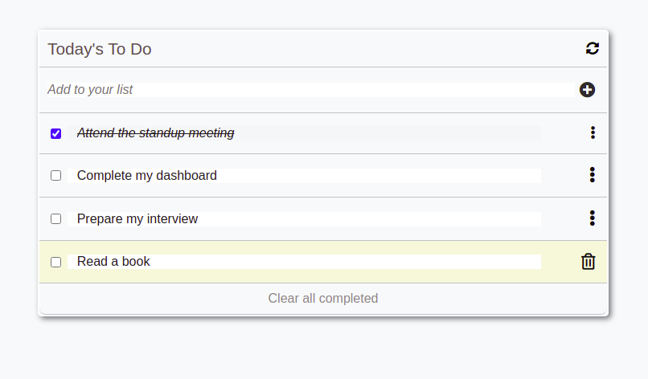

# JS_Best_Practices

## Description



> "JS_Best_Practices" is repo to practice code review of **JavaScript Best Practices** with coding partner

## Built With

- HTML
- CSS
- JavaScript

## Get Started

To get a local copy up and running follow  s these simple example steps.

1. Clone the Repo or Download the Zip file or ``` https://github.com/tresorsawasawa/JS_Best_Practices.git ```.
2. ``` cd /JS_Best_Practices ```
3. Open it with the live server by using this command: ``` npm run build ``` or ``` npm start ```

## Test

For tracking linter errors locally you need to follow these steps:

After cloning the project you need to run these commands

``` npm install ```  `` This command will download all the dependancies of the project ``

For tracking linter errors in HTML files run:

``` npx hint . ```

For tracking linter errors in CSS or SASS files run:

``` npx stylelint "\*_/_.{css,scss}" ```

And For tracking linter errors in JavaScript files run:

``` npx eslint . ```
## Live Demo

See the [Live](https://tresorsawasawa.github.io/JS_Best_Practices/)

## Authors

👤 **@Tresorsawasawa**

- GitHub: [@tresorsawasawa](https://github.com/tresorsawasawa)
- Twitter: [@tresorsawasawa](https://twitter.com/TresorSawasawa)
- LinkedIn: [Trésor Sawasawa](https://www.linkedin.com/in/tr%C3%A9sor-sawasawa-43745320b/)
## 🤝 Contributing

Contributions, issues, and feature requests are welcome!

Feel free to check the [issues page](../../issues/).

## Show your support

Give a ⭐️ if you like this project!

## Acknowledgments

- Thanks to everyone who will get time to check this code and sugest any [issue](https://github.com/tresorsawasawa/MyPortfolio/issues) to improve the page.
- Thank you [Microverse](https://www.microverse.org/)

## 📝 License

This project is [MIT](./MIT.md) licensed.
